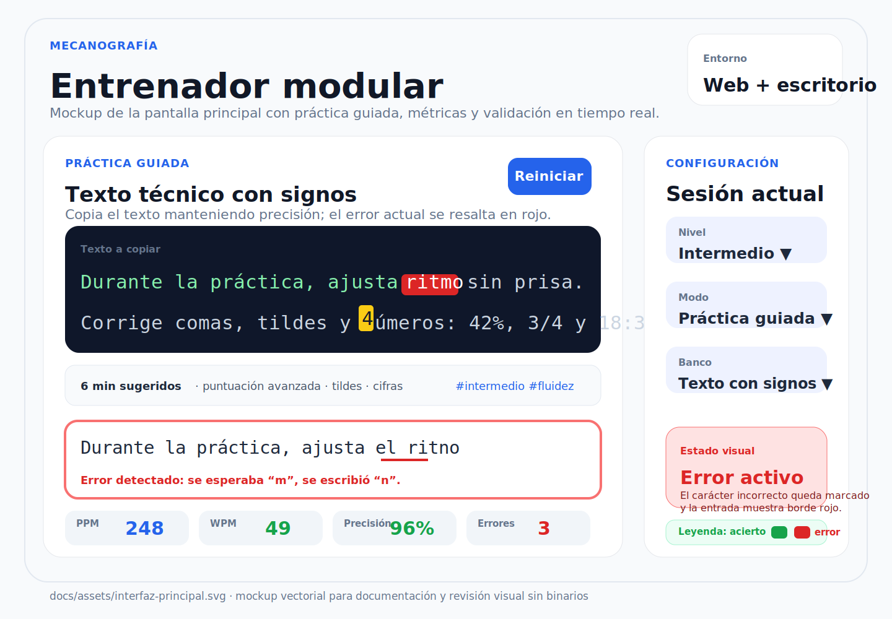

# Mecanografía

Mecanografía es un entrenador modular de mecanografía en español. El producto final combina una aplicación web con ejercicios guiados, evaluación inicial, pruebas cronometradas, métricas de velocidad y precisión, bancos de ejercicios por nivel y persistencia local del progreso.



## Descripción del proyecto

El objetivo del proyecto es ayudar a mejorar la velocidad, precisión y constancia al escribir en teclado. La aplicación prioriza una progresión clara por niveles, retroalimentación inmediata durante la copia y un historial local que permite comparar resultados entre sesiones.

La especificación funcional completa está documentada en [`docs/specification.md`](docs/specification.md). La arquitectura de ejercicios y validadores está detallada en [`docs/exercise-architecture.md`](docs/exercise-architecture.md).

## Funcionalidades principales

- Práctica de copia con validación carácter por carácter.
- Resaltado visual de caracteres correctos, incorrectos y pendientes.
- Evaluación inicial para estimar el nivel recomendado: `inicial`, `basico`, `intermedio`, `avanzado` o `experto`.
- Ejercicios básicos, intermedios, avanzados y expertos en español.
- Textos largos con números, símbolos, puntuación avanzada, siglas y vocabulario variado.
- Métricas de PPM, WPM brutas, WPM netas, precisión, errores y progreso.
- Pruebas cronometradas y seguimiento del ritmo durante la práctica.
- Historial y configuración persistentes en el navegador mediante `localStorage`.
- Exportación e importación de respaldo JSON del progreso local.
- Empaquetado previsto para web, Electron y Tauri.

## Arquitectura

La aplicación web se monta desde `index.html` y carga `src/main.ts`, que inicializa la interfaz principal de práctica. El código fuente se organiza por responsabilidades:

- `src/features/`: flujos de producto, como práctica, progreso, evaluación y modo experto.
- `src/components/`: componentes de interfaz reutilizables.
- `src/core/`: cálculo de métricas y lógica base de escritura.
- `src/domain/`: reglas de evaluación, clasificación y puntuación.
- `src/exercises/`: carga y normalización de bancos de ejercicios.
- `src/services/`: servicios transversales, incluida la persistencia local.
- `src/storage/`: adaptadores finos para consumir almacenamiento desde la UI.
- `data/`: bancos JSON de ejercicios y textos.
- `electron/` y `src-tauri/`: puntos de entrada para ejecución de escritorio.

La arquitectura de ejercicios separa la sesión, el temporizador, las métricas y los validadores por modo. El contrato de integración permite añadir modos como copia exacta, palabras, frases, texto completo o escritura libre sin reescribir la capa de métricas. Consulta [`docs/exercise-architecture.md`](docs/exercise-architecture.md) para el detalle técnico.

## Instalación

Requisitos recomendados:

- Node.js 20 o superior.
- npm 10 o superior.
- Para Tauri: Rust, Cargo y dependencias del sistema requeridas por Tauri.

Tauri forma parte de las plataformas de escritorio soportadas por el producto. Por eso `src-tauri/Cargo.lock` se mantiene versionado: las aplicaciones finales de Rust deben conservar el lockfile para que CI y los builds locales resuelvan las mismas versiones de dependencias y produzcan builds reproducibles. Si se modifica `src-tauri/Cargo.toml`, actualiza y revisa también `src-tauri/Cargo.lock` en el mismo cambio.

Instala las dependencias de JavaScript con:

```bash
npm install
```

> Nota: el proyecto no versiona actualmente un `package-lock.json`; si necesitas instalaciones reproducibles en CI, genera y conserva el lockfile con la versión de npm acordada por el equipo.

## Ejecución web

El comando oficial de desarrollo, una vez reparado `package.json`, es:

```bash
npm run dev
```

Vite sirve la aplicación en modo desarrollo y escucha en `0.0.0.0`. En local, abre la URL que muestre la terminal; normalmente será `http://localhost:5173`.

Para generar una build de producción, el comando oficial es:

```bash
npm run build
```

Este comando ejecuta primero TypeScript (`tsc`) y después genera el paquete web con Vite.

Para revisar la build generada:

```bash
npm run preview
```

## Ejecución local

Además de la web con Vite, el repositorio incluye entradas para escritorio:

### Electron

```bash
npm run electron:dev
```

Este comando arranca Vite, espera a que esté disponible `http://localhost:5173` y abre la aplicación con Electron.

### Tauri

```bash
npm run tauri:dev
```

Para compilar la aplicación Tauri:

```bash
npm run tauri:build
```

### Servidor estático simple

Si solo quieres inspeccionar archivos estáticos sin el flujo de Vite, puedes servir el directorio del repositorio con:

```bash
python3 -m http.server 4173
```

Después visita `http://localhost:4173`. Para desarrollo activo se recomienda usar siempre `npm run dev`.

## Tests

El comando oficial de tests, una vez reparado `package.json`, es:

```bash
npm test
```

Actualmente ejecuta `node --test`, que cubre las pruebas JavaScript y TypeScript preparadas para el runner nativo de Node.

Pruebas adicionales disponibles para módulos Python:

```bash
python -m pytest
```

Comprobación completa recomendada antes de abrir cambios:

```bash
npm run build
npm test
python -m pytest
```

## Datos de ejercicios

Los ejercicios se almacenan como bancos JSON y se normalizan desde `src/exercises/loadExerciseBank.ts`.

- [`data/ejercicios.json`](data/ejercicios.json): banco principal de ejercicios con niveles, tipos, textos, duración sugerida, objetivos técnicos y etiquetas.
- [`data/ejercicios-basicos.json`](data/ejercicios-basicos.json): ejercicios básicos con palabras frecuentes, frases breves, puntuación sencilla y metadatos pedagógicos.
- [`data/textos_avanzados.json`](data/textos_avanzados.json): textos avanzados y expertos con cifras, puntuación, símbolos y metadatos de dificultad.

La evaluación inicial de Python expone `TEXTO_ESTANDAR`, `evaluar_texto` y `clasificar_nivel` desde el paquete `mecanografia` para calcular duración, caracteres correctos, errores estimados, PPM, WPM, precisión y nivel recomendado.

Ejemplo de uso:

```python
from mecanografia import TEXTO_ESTANDAR, evaluar_texto

resultado = evaluar_texto(
    texto_usuario=TEXTO_ESTANDAR,
    duracion_segundos=120,
)

print(resultado.precision, resultado.wpm_neto, resultado.nivel_recomendado)
```

## Persistencia

La persistencia principal usa `localStorage` y está implementada en `src/services/localStorageService.ts`. El servicio guarda un respaldo JSON con `schemaVersion: 1` bajo la clave `mecanografia:persistence:v1`.

El esquema persistido incluye:

- `profile`: perfil local del usuario.
- `settings`: configuración de la experiencia, incluido `maxHistoryItems`.
- `initialAssessment`: última evaluación inicial.
- `exerciseHistory`: historial de ejercicios completados.
- `freeTestResults`: resultados de pruebas libres.
- `levelProgress`: progreso agregado por nivel.

La importación de respaldos puede fusionarse con el historial local para evitar sobrescribir datos ya guardados en el dispositivo.

## Estado actual y roadmap

### Estado actual

- Aplicación web con Vite y TypeScript.
- Pantalla principal de práctica montada desde `src/main.ts`.
- Bancos de ejercicios básicos, principales y avanzados.
- Evaluación inicial y cálculo de métricas disponibles en módulos de dominio.
- Persistencia local versionada con exportación e importación JSON.
- Scripts oficiales definidos en `package.json` para desarrollo, build, tests, Electron y Tauri.
- Documentación funcional y técnica enlazada desde este README.

### Roadmap

- Consolidar todos los modos de práctica en la UI final documentada por la especificación.
- Completar la recomendación automática de ejercicios según desempeño y errores frecuentes.
- Ampliar visualizaciones de progreso, tendencias y consistencia.
- Definir una estrategia de sincronización opcional sin reemplazar el modo local-first.
- Añadir migraciones explícitas para futuras versiones del esquema de persistencia.
- Publicar builds verificadas para web, Electron y Tauri.
